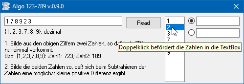

# Algo1234789
## <AppShortDescription>  

[](https://github.com/OlimilO1402/Algo_123-789/blob/master/LICENSE) 
[](https://github.com/OlimilO1402/Algo_123-789/releases/latest)
[](https://github.com/OlimilO1402/Algo_123-789/releases/download/v0.9.0/Algo123789_v0.9.0.zip)
[](https://github.com/OlimilO1402/Algo_123-789/watchers)

Project started around december 2007.  
<AppLongDescription>  


```vba
Property Get Value()
End Property
```


